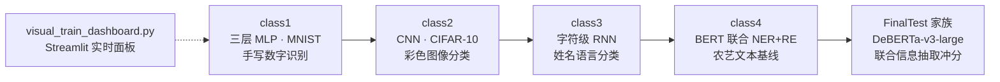
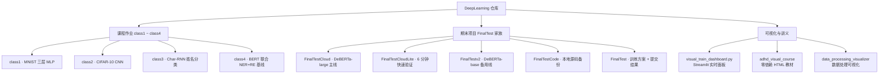
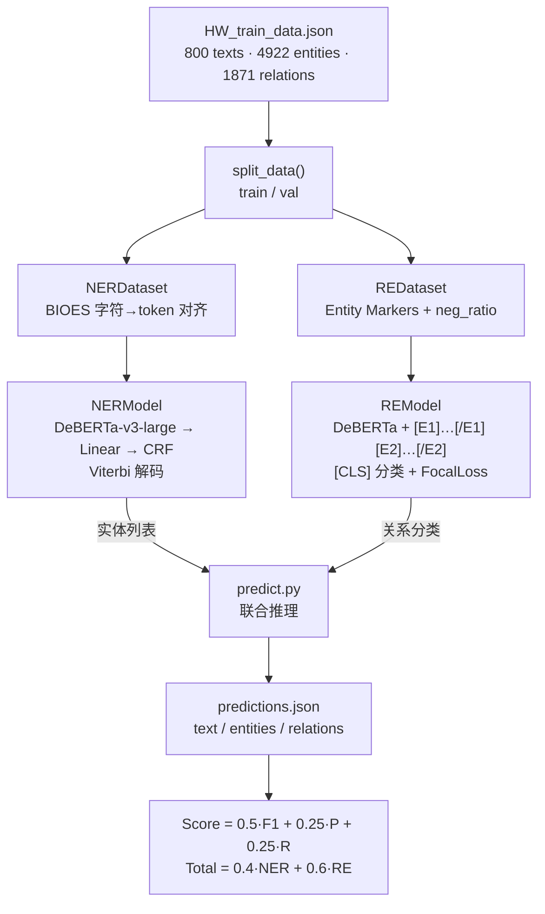
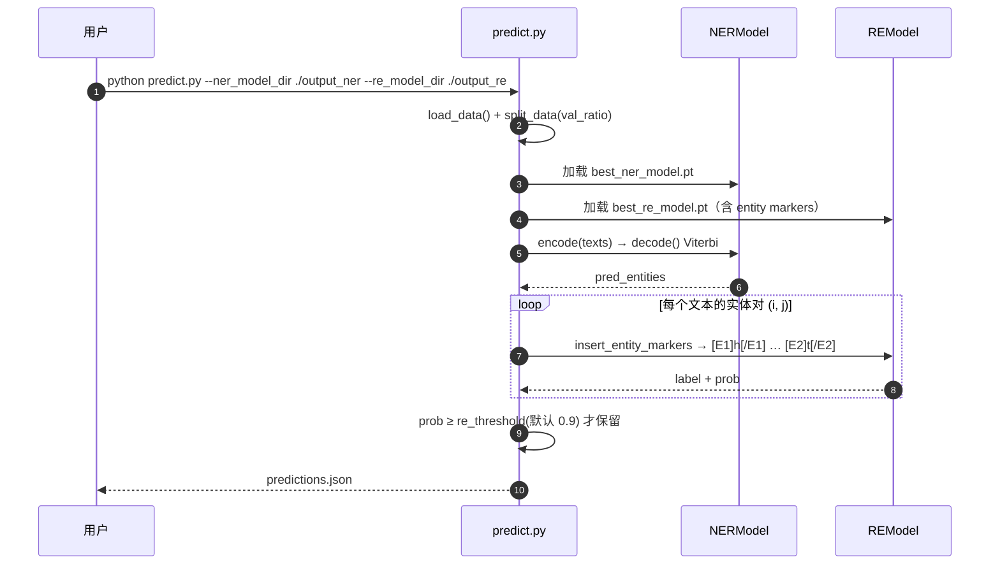
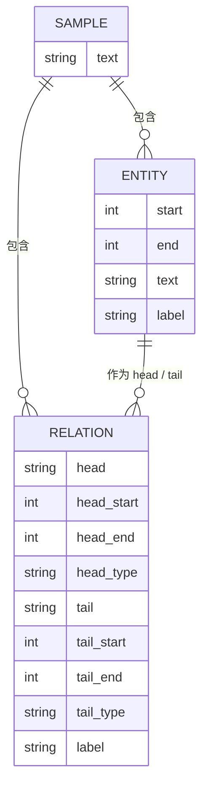

<div align="center">

> [English](./README_en.md) | **简体中文**


# DeepLearning · 深度学习课程作业仓库

**从三层 MLP 到 DeBERTa 联合 NER+RE —— 一门深度学习课的完整代码弧线**

手写数字 → 彩色图像 → 姓名语言 → 农艺文本信息抽取，四节课加一个期末冲分项目，全部可跑。


</div>

---

## 它解决什么问题

学深度学习时，代码、Notebook、讲义、作业文档往往散落各处：这节课是脚本，下节课是 notebook，期末项目又搬去云端；换个机器就不知道从哪跑起。这个仓库把**一门深度学习课程的全部产出**收进一个目录树，并且每一部分都保持「有代码、有讲义、能复现」：

- **课程作业有清晰递进**：`class1 → class4`，模型从全连接一路走到 Transformer，任务从图像分类走到序列标注与关系抽取。
- **期末项目有完整工程形态**：`FinalTest*` 系列给出数据管线、模型定义、训练脚本、联合推理、云端 Notebook 与评测公式，而不只是一个答案文件。
- **配套可视化讲义**：Streamlit 实时训练面板 + 两个零依赖 HTML 教材，把「训练时到底发生了什么」讲清楚。

> 这是一个**个人课程作业仓库**，不是通用框架。它记录的是学习路径与真实可跑的代码，而非面向生产的分发工具。

---

## ✨ 功能

- 🧱 **四节递进式课程作业**：三层 MLP（MNIST）→ CNN（CIFAR-10）→ 字符级 RNN（18 种语言姓名分类）→ BERT 联合 NER+RE 基线。
- 🎯 **期末项目：农艺文本联合信息抽取**：DeBERTa-v3-large 上做 NER（12 类实体，BIOES + CRF）与 RE（6 类关系，Entity Markers），并按官方榜单公式计分。
- ☁️ **两阶段云端执行方案**：`FinalTestCloudLite`（约 6 分钟）先验证代码无 bug，再跑 `FinalTestCloud`（约 45 分钟）出最终分数。
- 🔁 **RE 可续训**：`train_re.py` 支持 `--resume_from`，从已有 checkpoint 的 epoch 继续，而非从头重训。
- 📊 **可视化讲义三件套**：`visual_train_dashboard.py`（Streamlit 实时面板）、`adhd_visual_course`（从 Python 讲到 Transformer 的零依赖 HTML 教材）、`data_processing_visualizer`（把 JSON 讲成 NER/RE 训练样本）。
- 🖥️ **设备自适应**：脚本统一按 `MPS → CUDA → CPU` 自动选择训练硬件。

---

## 🚀 快速开始

### 方式一：面向 AI Agent（一键跑通，推荐）

把下面这段提示词直接发给你的本地 AI Agent（Claude Code / Codex / OpenCode …）：

````markdown
请帮我在本机跑通 DeepLearning 仓库（GitHub: https://github.com/RayMorTwinkle/DeepLearning）。
这是一个深度学习课程作业仓库，含 class1~class4 四节课和一个期末 NER+RE 项目。

环境：Python 3.11 + PyTorch（优先 MPS，其次 CUDA，最后 CPU）。

步骤：
1. 克隆：git clone https://github.com/RayMorTwinkle/DeepLearning.git && cd DeepLearning
2. 建环境：conda create -n ml_env python=3.11 -y && conda activate ml_env
3. 装依赖：conda install pytorch torchvision -c pytorch && pip install notebook
4. 验证设备：python -c "import torch; print(torch.__version__, torch.backends.mps.is_available(), torch.cuda.is_available())"
5. 跑第一节课：cd class1 && python train_mnist_mlp.py  （应看到测试准确率约 97%~98%）
6. 期末项目看 FinalTest/训练方案.md，按其中 Cell 顺序在 GPU 云环境运行 FinalTestCloudLite（先）与 FinalTestCloud（后）。
7. 向用户汇报每步结果与设备型号。
````

### 方式二：面向人类用户

```bash
git clone https://github.com/RayMorTwinkle/DeepLearning.git
cd DeepLearning

conda create -n ml_env python=3.11 -y
conda activate ml_env
conda install pytorch torchvision -c pytorch
pip install notebook

# 第一节课：MNIST 三层 MLP（自动下载数据）
cd class1 && python train_mnist_mlp.py
```

> **环境要求**：Python 3.11、PyTorch、torchvision。期末 NER/RE 项目另需 `transformers<5`、`sentencepiece`、`pytorch-crf`、`scikit-learn`、`tqdm`（见 `FinalTestCloud/requirements.txt`）。训练 DeBERTa-v3-large 建议 CUDA 显存 ≥ 16GB。

---

## 🖥️ 使用

### 各节课运行方式

| 课程 | 目录 | 运行 | 产物 |
|---|---|---|---|
| 一 · MNIST 三层 MLP | `class1/` | `python train_mnist_mlp.py` | `best_mlp_mnist.pth` |
| 二 · CIFAR-10 CNN | `class2/` | `python train_cifar10_cnn.py` | `best_cnn_cifar10.pth` |
| 三 · 字符级 RNN 姓名分类 | `class3/` | `python char_rnn_classification.py` | `char_rnn_model.pth` |
| 四 · BERT 联合 NER+RE 基线 | `class4/` | `python baseline.py` | `output/best_model.pt` |
| 可视化训练面板 | 根目录 | `streamlit run visual_train_dashboard.py` | 本地 `http://localhost:8501` |

### 期末项目（FinalTest 家族）

```bash
# 云端 GPU 环境（魔搭 / Colab / AI Studio 通用）
# 1) 先跑 Lite 版验证代码（~6 分钟）
#    上传 FinalTestCloudLite/ 全部文件 → 打开 main_lite.ipynb → 逐 Cell 运行
# 2) 再跑完整版出分（~45 分钟）
#    上传 FinalTestCloud/ 全部文件 → 打开 main.ipynb → 逐 Cell 运行

# 也可直接命令行训练（完整版默认参数）
python train_ner.py --data HW_train_data.json --model ./deberta-v3-large \
  --epochs 8 --batch_size 12 --lr 1e-5 --val_ratio 0.05 --patience 2
python train_re.py  --data HW_train_data.json --model ./deberta-v3-large \
  --epochs 6 --batch_size 12 --lr 1e-5 --neg_ratio 1 --val_ratio 0.05 --patience 2
python predict.py --ner_model_dir ./output_ner --re_model_dir ./output_re \
  --data HW_train_data.json --output predictions.json --re_threshold 0.9 --evaluate
```

输出 `predictions.json`，结构为 `[{ "text", "entities": [...], "relations": [...] }, ...]`。

---

## 🏗️ 架构

### 一、学习路线（四节课的递进）



### 二、仓库内容地图



### 三、期末项目训练流程



### 四、联合推理时序（`predict.py`）



### 五、数据模型（`HW_train_data.json`）



---

## 📂 目录结构

```text
DeepLearning/
├── class1/                         # 第一节课：MNIST 三层 MLP
│   ├── train_mnist_mlp.py          #   训练脚本（MPS/CUDA/CPU 自适应）
│   ├── mnist_mlp_notebook.ipynb    #   notebook 版
│   ├── MNIST_MLP_3L_GUIDE.md       #   三层结构 / 参数完整讲义
│   └── best_mlp_mnist.pth          #   已训练模型
├── class2/                         # 第二节课：CIFAR-10 CNN
│   ├── train_cifar10_cnn.py        #   4 层卷积 + BN 的 CNN
│   ├── best_cnn_cifar10.pth        #   CNN 权重
│   └── best_mlp_cifar10.pth        #   MLP 对照权重（脚本未随仓库保留，待确认）
├── class3/                         # 第三节课：字符级 RNN 姓名分类
│   ├── char_rnn_classification.py  #   可运行脚本
│   ├── char_rnn_classification.ipynb
│   ├── char_rnn_classification.md  #   完整教程（含 18 语言数据集说明）
│   ├── char_rnn_model.pth          #   训练好的模型
│   └── data/names/                  #   18 种语言姓名 .txt
├── class4/                         # 第四节课：BERT 联合 NER+RE 基线
│   ├── baseline.py                 #   双任务头基线（NER + 实体对 RE）
│   ├── ner_re_pipeline.ipynb       #   Pipeline 版 notebook
│   ├── analyze_data.py             #   数据分布 / span 重叠 / 标签统计
│   ├── HW_train_data.json          #   800 条农艺标注数据
│   ├── 数据说明.md                  #   12 类实体 + 6 类关系定义与评分公式
│   └── output/best_model.pt        #   基线最佳模型
├── FinalTest/                      # 期末项目：文档 + 可视化教材
│   ├── 训练方案.md                  #   两阶段云端执行 + 参数 + 排查指南
│   ├── 数据说明.md
│   ├── predictions_submit.json     #   提交结果
│   └── adhd_visual_course/         #   零依赖 HTML 教材（index.html）
├── FinalTestCloud/                 # 期末完整版（DeBERTa-v3-large 主线）
│   ├── main.ipynb / tools.ipynb    #   主 Notebook + 文件管理工具
│   ├── data_utils.py               #   BIOES / 对齐 / Entity Markers / 指标
│   ├── ner_model.py / re_model.py  #   NER(CRF) / RE(FocalLoss) 模型定义
│   ├── train_ner.py / train_re.py  #   两个训练脚本（RE 支持续训）
│   ├── predict.py                  #   联合推理 + 评估
│   └── requirements.txt
├── FinalTestCloudLite/             # 期末快速验证版（~6 分钟，其它同上）
├── FinalTestCode/                  # 本地源码备份（不上传云端）
├── FinalTestv2/                    # DeBERTa-base 备用方案（含主 Notebook）
│   ├── main_base.ipynb / gen_main_base.py
│   ├── analyze_predictions.py
│   └── data_processing_visualizer/ #   数据处理可视化（零依赖网页）
├── data/                           # 预留数据目录（当前为空）
├── visual_train_dashboard.py       # Streamlit 实时训练面板
├── VISUAL_DASHBOARD_GUIDE.md       #   面板使用说明
└── history_202605201637.md         # 开发过程记录
```

---

## 🔧 技术细节

### 期末 NER/RE 任务定义

- **实体类型（12）**：`CROP`（作物）、`VAR`（品种）、`TRT`（性状）、`GST`（生育时期）、`GENE`（基因）、`QTL`、`MRK`（分子标记）、`CHR`（染色体）、`BM`（育种方法）、`CROSS`（亲本/杂交组合）、`ABS`（非生物胁迫）、`BIS`（生物胁迫）。
- **关系类型（6）**：`CON`（包含）、`USE`（采用）、`HAS`（具有）、`AFF`（影响）、`OCI`（发生于）、`LOI`（定位于）；RE 分类时再加上 `NONE`，共 7 个标签。
- **NER 标签空间**：BIOES 编码，`1 + 12 × 4 = 49` 个标签（`NER_LABEL2ID`）；序列标注用 CRF 做 Viterbi 解码。

### 真实数据统计（`class4/HW_train_data.json`）

| 项目 | 值 |
|---|---|
| 样本数 | 800 |
| 实体总数 | 4,922 |
| 关系总数 | 1,871 |
| 实体分布（不均衡） | TRT 1417 → CROSS 46 |
| 关系分布（不均衡） | LOI 568 → OCI 53 |

### 关键参数

| 模块 | 参数 |
|---|---|
| class1 MNIST MLP | `hidden_dim=256`, `dropout=0.1`, `lr=8e-4`, `weight_decay=1e-4`, `epochs=12`, AdamW |
| class2 CIFAR-10 CNN | `lr=1e-3`, `batch_size=128`, `epochs=30`，训练集用 RandomCrop(32, pad=4) + HorizontalFlip |
| class3 Char-RNN | `N_HIDDEN=128`, `lr=0.005`, 迭代 100,000 次，NLLLoss + 手动 SGD |
| class4 基线 | `max_seq_len=512`, `batch_size=8`, `epochs=20`, `lr=2e-5`，`train_split=0.85` |
| FinalTest NER | DeBERTa-v3-large(434M) + Linear + CRF，`max_length=384`, `batch=12`, `lr=1e-5`, `epochs=8` |
| FinalTest RE | DeBERTa-v3-large + Entity Markers，`batch=12`, `lr=1e-5`, `epochs=6`, `neg_ratio=1`，Focal Loss(γ=2) |

### 工程细节（下沉到函数/键名）

- **设备选择**：`get_device()` 统一按 `MPS → CUDA → CPU` 回退（`class1`、`class2`、`FinalTestCloud/ner_model.py`、`train_re.py` 各自实现）。
- **BIOES 标签映射**：`build_ner_label_map()` 由 `ENTITY_TYPES` 生成 `NER_LABEL2ID` / `NER_ID2LABEL`，`NUM_NER_LABELS = 49`。
- **字符→token 对齐**：`tokenize_and_align_ner()` 用 `return_offsets_mapping=True` 把字符级 BIOES 映射到子词级；子词同时含 `B-/I-/E-/S-` 时按 `S > B > E > I` 优先级取标签，特殊 token 与 padding 标 `-100`。
- **实体还原**：`tokens_to_entities_with_offsets()` 从 token 级标签还原字符级 span，并用 `normalize_span()` 去掉 SentencePiece 偏移里夹带的空格。
- **Entity Markers**：`add_entity_marker_tokens()` 为 tokenizer 注入 `[E1] [/E1] [E2] [/E2]` 四个特殊 token（`resize_token_embeddings(len(tokenizer))`），`insert_entity_markers()` 从右向左插入标记以保证偏移正确。
- **RE 负采样**：`prepare_re_samples()` 枚举全部有序实体对，正样本全保留，负样本按 `neg_ratio` 采样并打上 `NONE`。
- **关系标签归一**：原始标注 `CONTAINS/USES/HAS/AFFECTS/OCCURS_IN/LOCATED_IN` 在 `prepare_re_samples()` 与 `predict.py` 中映射为 `CON/USE/HAS/AFF/OCI/LOI`。
- **CRF 细节**：`NERModel` 把 `-100` 替换为 0 再用 `attention_mask.bool()` 做 CRF mask，`loss = -crf(...)`。
- **混合精度**：`train_ner.py`/`train_re.py` 在 CUDA 上启用 `torch.amp.autocast` + `GradScaler`，并保证模型 `float32` 训练避免 FP16 溢出。
- **续训**：`train_re.py --resume_from` 读取 checkpoint 的 `epoch` 与 `val_metrics`，从记录的 epoch 之后继续（`--epochs 8` 表示「训练到总第 8 轮」，非再跑 8 轮）。
- **推理内存优化**：`predict.py:load_checkpoint_cpu()` 用 `mmap=True` 加载并丢弃 `optimizer_state_dict`，避免推理时把 Adam 状态搬进内存。
- **评分公式**：`compute_score()` = `0.5·F1 + 0.25·P + 0.25·R`；`compute_total_score()` = `0.4·NER + 0.6·RE`。

### 已跑出的参考结果（来自 `FinalTest/训练方案.md`）

| 指标 | 值 | 说明 |
|---|---|---|
| NER F1 | 0.6313 | 与训练时验证分数对齐 |
| RE 训练验证 F1 | 0.7514 | 用 gold 实体训练/验证 RE |
| Pipeline RE F1 | 0.2614 | NER 预测实体后再跑 RE 的真实流水线 |
| Total Score | 0.4113 | `re_threshold=0.9` 时最优 |

---

## ❓ 常见问题

**Q：`class2` 里为什么有两个 `.pth`，但只有一个训练脚本？**
A：仓库保留的是 CNN 脚本 `train_cifar10_cnn.py`；`best_mlp_cifar10.pth` 是早期 MLP 对照实验留下的权重，对应脚本未随仓库保留（待确认）。

**Q：期末项目必须用 GPU 吗？**
A：必须。DeBERTa-v3-large 有 434M 参数，CPU 环境只适合下载模型；`FinalTest/训练方案.md` 明确要求训练前确认输出里有 `CUDA: True`，推荐 A10 24GB / V100 32GB。

**Q：`FinalTestCloud` 和 `FinalTestCloudLite` 什么关系？**
A：同一套代码的两档。Lite 版 `epochs=2`、约 6 分钟，用来先确认代码无 bug；完整版 `NER 8 轮 / RE 6 轮`、约 45 分钟，出最终分数。建议先 Lite 后完整。

**Q：`FinalTestv2` 是什么？**
A：备用实验线，用更小的 `deberta-v3-base` 快速多试一条路线（`epochs=10, batch=24, lr=2e-5`），不替代 large 主线。

**Q：可视化教材需要装环境吗？**
A：`FinalTest/adhd_visual_course/index.html` 与 `FinalTestv2/data_processing_visualizer/index.html` 都是零依赖静态页，直接用浏览器打开即可。

**Q：`streamlit run` 路径写死了怎么办？**
A：`VISUAL_DASHBOARD_GUIDE.md` 里的命令用了绝对路径，跨机器请把路径换成你本地的 `visual_train_dashboard.py`。

---

## ⚠️ 注意事项

- 这是**个人课程作业仓库**，代码按「能跑、能复现」组织，未做跨平台打包与自动化测试。
- 仓库内包含体积较大的模型权重（`.pth` / `.pt`）与数据集（MNIST raw、CIFAR-10、18 语言姓名），克隆后体积可观；云端训练请按 `FinalTest/训练方案.md` 只上传所需文件。
- 期末项目的训练脚本硬编码了部分本地绝对路径（如 `class4/baseline.py` 内的 `data_path`），迁移到其它机器前需自行调整。
- 国内平台下载 HuggingFace 模型需设置镜像（Notebook 内已用 `HF_ENDPOINT=https://hf-mirror.com`）。
- README 中的参考分数来自作者本地/云端实验，**不代表隐藏测试集成绩**。

---

## 📄 License

本仓库未附带开源许可证文件，默认保留所有权利。若需对外分发或复用，请先补充许可证。

---

## 🙏 致谢 / Credits

- **课程与作业设计**：本仓库为深度学习课程作业，任务定义、数据（农艺 NER/RE）与评分公式来自课程方。
- **class3** 改编自 PyTorch 官方教程 [NLP From Scratch: Classifying Names with a Character-Level RNN](https://docs.pytorch.org/tutorials/intermediate/char_rnn_classification_tutorial.html)（作者 Sean Robertson）。
- **期末模型栈**：`microsoft/deberta-v3-large`、`pytorch-crf`、`transformers`、`seqeval`、`scikit-learn`、`streamlit`。
- README（中英双语）与架构图为本次重制。

---

<div align="center">
<sub>DeepLearning · 把一门课，跑成一条完整的学习曲线</sub>
</div>
