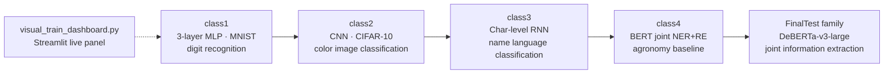
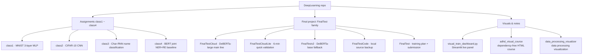
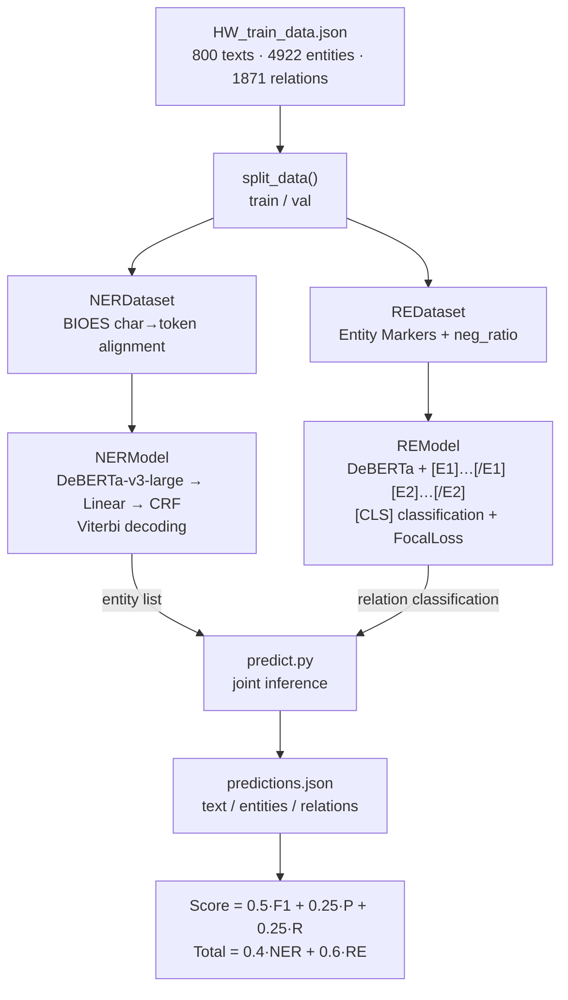
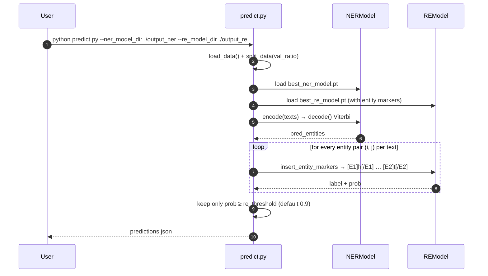
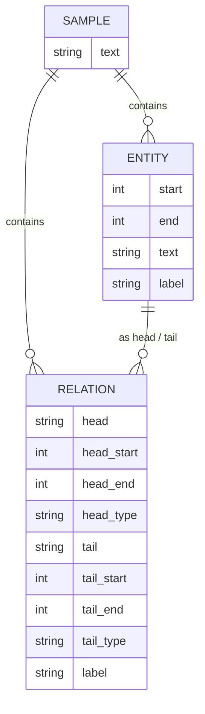

<div align="center">

> [简体中文](./README.md) | **English**


# DeepLearning · A Deep Learning Course Portfolio

**From a 3-layer MLP to DeBERTa joint NER+RE — the full code arc of one deep learning course**

Digits → color images → name languages → agronomy text extraction. Four classes plus a final scoring project, all runnable.


</div>

---

## Why it exists

When you learn deep learning, code, notebooks, lecture notes and assignments tend to scatter: one class is a script, the next is a notebook, and the final project moves to the cloud. On a new machine you no longer know where to start. This repo gathers **all output of one deep learning course** into a single tree, and keeps every part "has code, has notes, is reproducible":

- **A clear progression across classes**: `class1 → class4`, models move from fully-connected to Transformer, tasks from image classification to sequence labeling and relation extraction.
- **A final project with real engineering shape**: the `FinalTest*` family ships data pipelines, model definitions, training scripts, joint inference, cloud notebooks and the scoring formula — not just an answer file.
- **Visual companions**: a Streamlit live-training dashboard plus two dependency-free HTML courses that explain what actually happens during training.

> This is a **personal course/assignment repo**, not a general framework. It documents a learning path with genuinely runnable code, rather than being a production distribution.

---

## ✨ Features

- 🧱 **Four progressive assignments**: 3-layer MLP (MNIST) → CNN (CIFAR-10) → character-level RNN (18-language name classification) → BERT joint NER+RE baseline.
- 🎯 **Final project: joint information extraction on agronomy text**: NER (12 entity types, BIOES + CRF) and RE (6 relation types, Entity Markers) on top of DeBERTa-v3-large, scored with the official leaderboard formula.
- ☁️ **Two-stage cloud plan**: run `FinalTestCloudLite` (~6 min) to validate the code first, then `FinalTestCloud` (~45 min) for the final score.
- 🔁 **Resumable RE training**: `train_re.py` supports `--resume_from`, continuing from the epoch recorded in an existing checkpoint instead of retraining from scratch.
- 📊 **Three visual companions**: `visual_train_dashboard.py` (Streamlit live panel), `adhd_visual_course` (dependency-free HTML course from Python to Transformers), and `data_processing_visualizer` (turns the raw JSON into NER/RE training samples).
- 🖥️ **Automatic device selection**: scripts pick training hardware with an `MPS → CUDA → CPU` fallback.

---

## 🚀 Quick Start

### Option 1: For AI Agents (one-shot, recommended)

Send this prompt to your local AI agent (Claude Code / Codex / OpenCode …):

````markdown
Please get the DeepLearning repo running on my machine (GitHub: https://github.com/RayMorTwinkle/DeepLearning).
It is a deep learning course repo with classes 1–4 plus a final NER+RE project.

Environment: Python 3.11 + PyTorch (prefer MPS, then CUDA, then CPU).

Steps:
1. Clone: git clone https://github.com/RayMorTwinkle/DeepLearning.git && cd DeepLearning
2. Create env: conda create -n ml_env python=3.11 -y && conda activate ml_env
3. Install: conda install pytorch torchvision -c pytorch && pip install notebook
4. Verify device: python -c "import torch; print(torch.__version__, torch.backends.mps.is_available(), torch.cuda.is_available())"
5. Run class 1: cd class1 && python train_mnist_mlp.py  (expect ~97%–98% test accuracy)
6. For the final project, read FinalTest/训练方案.md and run FinalTestCloudLite (first) then FinalTestCloud (after) on a GPU cloud runtime.
7. Report the result of each step and the device model to me.
````

### Option 2: For humans

```bash
git clone https://github.com/RayMorTwinkle/DeepLearning.git
cd DeepLearning

conda create -n ml_env python=3.11 -y
conda activate ml_env
conda install pytorch torchvision -c pytorch
pip install notebook

# Class 1: MNIST 3-layer MLP (data downloads automatically)
cd class1 && python train_mnist_mlp.py
```

> **Requirements**: Python 3.11, PyTorch, torchvision. The final NER/RE project additionally needs `transformers<5`, `sentencepiece`, `pytorch-crf`, `scikit-learn`, `tqdm` (see `FinalTestCloud/requirements.txt`). Training DeBERTa-v3-large recommends ≥ 16GB CUDA memory.

---

## 🖥️ Usage

### Running each class

| Class | Directory | Command | Artifact |
|---|---|---|---|
| 1 · MNIST 3-layer MLP | `class1/` | `python train_mnist_mlp.py` | `best_mlp_mnist.pth` |
| 2 · CIFAR-10 CNN | `class2/` | `python train_cifar10_cnn.py` | `best_cnn_cifar10.pth` |
| 3 · Char-level RNN name classification | `class3/` | `python char_rnn_classification.py` | `char_rnn_model.pth` |
| 4 · BERT joint NER+RE baseline | `class4/` | `python baseline.py` | `output/best_model.pt` |
| Visual training dashboard | repo root | `streamlit run visual_train_dashboard.py` | local `http://localhost:8501` |

### Final project (the FinalTest family)

```bash
# Cloud GPU runtime (ModelScope / Colab / AI Studio)
# 1) Run the Lite version first to validate the code (~6 min)
#    Upload all of FinalTestCloudLite/ → open main_lite.ipynb → run cells in order
# 2) Then run the full version for the score (~45 min)
#    Upload all of FinalTestCloud/ → open main.ipynb → run cells in order

# Or train directly from the command line (full-version defaults)
python train_ner.py --data HW_train_data.json --model ./deberta-v3-large \
  --epochs 8 --batch_size 12 --lr 1e-5 --val_ratio 0.05 --patience 2
python train_re.py  --data HW_train_data.json --model ./deberta-v3-large \
  --epochs 6 --batch_size 12 --lr 1e-5 --neg_ratio 1 --val_ratio 0.05 --patience 2
python predict.py --ner_model_dir ./output_ner --re_model_dir ./output_re \
  --data HW_train_data.json --output predictions.json --re_threshold 0.9 --evaluate
```

The output `predictions.json` has the shape `[{ "text", "entities": [...], "relations": [...] }, ...]`.

---

## 🏗️ Architecture

### 1. Learning path (the four classes)



### 2. Repository content map



### 3. Final project training flow



### 4. Joint inference sequence (`predict.py`)



### 5. Data model (`HW_train_data.json`)



---

## 📂 Project layout

```text
DeepLearning/
├── class1/                         # Class 1: MNIST 3-layer MLP
│   ├── train_mnist_mlp.py          #   training script (MPS/CUDA/CPU auto)
│   ├── mnist_mlp_notebook.ipynb    #   notebook version
│   ├── MNIST_MLP_3L_GUIDE.md       #   full notes on the 3-layer design / hyperparams
│   └── best_mlp_mnist.pth          #   trained model
├── class2/                         # Class 2: CIFAR-10 CNN
│   ├── train_cifar10_cnn.py        #   4-conv-layer CNN with batch norm
│   ├── best_cnn_cifar10.pth        #   CNN weights
│   └── best_mlp_cifar10.pth        #   MLP control weights (producing script not kept, TBC)
├── class3/                         # Class 3: char-level RNN name classification
│   ├── char_rnn_classification.py  #   runnable script
│   ├── char_rnn_classification.ipynb
│   ├── char_rnn_classification.md  #   full tutorial (incl. 18-language dataset)
│   ├── char_rnn_model.pth          #   trained model
│   └── data/names/                  #   18 languages of name .txt files
├── class4/                         # Class 4: BERT joint NER+RE baseline
│   ├── baseline.py                 #   dual-head baseline (NER + entity-pair RE)
│   ├── ner_re_pipeline.ipynb       #   pipeline notebook
│   ├── analyze_data.py             #   distribution / span overlap / label stats
│   ├── HW_train_data.json          #   800 annotated agronomy samples
│   ├── 数据说明.md                  #   12 entity + 6 relation definitions & scoring
│   └── output/best_model.pt        #   best baseline model
├── FinalTest/                      # Final project: docs + visual course
│   ├── 训练方案.md                  #   2-stage cloud plan + params + troubleshooting
│   ├── 数据说明.md
│   ├── predictions_submit.json     #   submission output
│   └── adhd_visual_course/         #   dependency-free HTML course (index.html)
├── FinalTestCloud/                 # Final full version (DeBERTa-v3-large main line)
│   ├── main.ipynb / tools.ipynb    #   main notebook + file-management tools
│   ├── data_utils.py               #   BIOES / alignment / Entity Markers / metrics
│   ├── ner_model.py / re_model.py  #   NER(CRF) / RE(FocalLoss) model defs
│   ├── train_ner.py / train_re.py  #   two training scripts (RE supports resume)
│   ├── predict.py                  #   joint inference + evaluation
│   └── requirements.txt
├── FinalTestCloudLite/             # Final quick-validation version (~6 min, otherwise same)
├── FinalTestCode/                  # Local source backup (not uploaded to cloud)
├── FinalTestv2/                    # DeBERTa-base fallback (with main notebook)
│   ├── main_base.ipynb / gen_main_base.py
│   ├── analyze_predictions.py
│   └── data_processing_visualizer/ #   data processing visualization (static page)
├── data/                           # Reserved data dir (currently empty)
├── visual_train_dashboard.py       # Streamlit live training dashboard
├── VISUAL_DASHBOARD_GUIDE.md       #   dashboard usage notes
└── history_202605201637.md         # development log
```

---

## 🔧 Technical notes

### Final NER/RE task definition

- **Entity types (12)**: `CROP`, `VAR`, `TRT`, `GST`, `GENE`, `QTL`, `MRK`, `CHR`, `BM`, `CROSS`, `ABS`, `BIS`.
- **Relation types (6)**: `CON`, `USE`, `HAS`, `AFF`, `OCI`, `LOI`; RE adds `NONE`, giving 7 classification labels.
- **NER label space**: BIOES encoding, `1 + 12 × 4 = 49` labels (`NER_LABEL2ID`); sequence labeling decoded with a CRF (Viterbi).

### Real data statistics (`class4/HW_train_data.json`)

| Item | Value |
|---|---|
| Samples | 800 |
| Total entities | 4,922 |
| Total relations | 1,871 |
| Entity distribution (imbalanced) | TRT 1417 → CROSS 46 |
| Relation distribution (imbalanced) | LOI 568 → OCI 53 |

### Key hyperparameters

| Module | Parameters |
|---|---|
| class1 MNIST MLP | `hidden_dim=256`, `dropout=0.1`, `lr=8e-4`, `weight_decay=1e-4`, `epochs=12`, AdamW |
| class2 CIFAR-10 CNN | `lr=1e-3`, `batch_size=128`, `epochs=30`, RandomCrop(32, pad=4) + HorizontalFlip |
| class3 Char-RNN | `N_HIDDEN=128`, `lr=0.005`, 100,000 iterations, NLLLoss + manual SGD |
| class4 baseline | `max_seq_len=512`, `batch_size=8`, `epochs=20`, `lr=2e-5`, `train_split=0.85` |
| FinalTest NER | DeBERTa-v3-large (434M) + Linear + CRF, `max_length=384`, `batch=12`, `lr=1e-5`, `epochs=8` |
| FinalTest RE | DeBERTa-v3-large + Entity Markers, `batch=12`, `lr=1e-5`, `epochs=6`, `neg_ratio=1`, Focal Loss (γ=2) |

### Engineering details (down to functions / keys)

- **Device selection**: `get_device()` uses the `MPS → CUDA → CPU` fallback (`class1`, `class2`, `FinalTestCloud/ner_model.py`, `train_re.py` each implement it).
- **BIOES label map**: `build_ner_label_map()` derives `NER_LABEL2ID` / `NER_ID2LABEL` from `ENTITY_TYPES`; `NUM_NER_LABELS = 49`.
- **Char→token alignment**: `tokenize_and_align_ner()` uses `return_offsets_mapping=True` to map char-level BIOES to subwords; when a subword carries both `B-/I-/E-/S-`, priority is `S > B > E > I`; special tokens and padding are marked `-100`.
- **Entity restoration**: `tokens_to_entities_with_offsets()` converts token-level labels back to char spans, and `normalize_span()` strips spaces that SentencePiece offsets may include.
- **Entity Markers**: `add_entity_marker_tokens()` injects `[E1] [/E1] [E2] [/E2]` (with `resize_token_embeddings(len(tokenizer))`); `insert_entity_markers()` inserts markers right-to-left so offsets stay correct.
- **RE negative sampling**: `prepare_re_samples()` enumerates all ordered entity pairs, keeps all positives, and samples negatives by `neg_ratio` labeled `NONE`.
- **Relation label normalization**: raw labels `CONTAINS/USES/HAS/AFFECTS/OCCURS_IN/LOCATED_IN` are mapped to `CON/USE/HAS/AFF/OCI/LOI` in both `prepare_re_samples()` and `predict.py`.
- **CRF detail**: `NERModel` replaces `-100` with 0, uses `attention_mask.bool()` as the CRF mask, and computes `loss = -crf(...)`.
- **Mixed precision**: `train_ner.py`/`train_re.py` enable `torch.amp.autocast` + `GradScaler` on CUDA and keep the model in `float32` to avoid FP16 overflow.
- **Resume**: `train_re.py --resume_from` reads the checkpoint's `epoch` and `val_metrics` and continues after the recorded epoch (`--epochs 8` means "train up to epoch 8", not 8 more).
- **Inference-memory optimization**: `predict.py:load_checkpoint_cpu()` loads with `mmap=True` and drops `optimizer_state_dict` so Adam states aren't materialized at inference.
- **Scoring**: `compute_score()` = `0.5·F1 + 0.25·P + 0.25·R`; `compute_total_score()` = `0.4·NER + 0.6·RE`.

### Reference results achieved (from `FinalTest/训练方案.md`)

| Metric | Value | Note |
|---|---|---|
| NER F1 | 0.6313 | aligns with training-time validation |
| RE train-val F1 | 0.7514 | RE trained/validated on gold entities |
| Pipeline RE F1 | 0.2614 | real pipeline: RE after predicted entities |
| Total Score | 0.4113 | best at `re_threshold=0.9` |

---

## ❓ FAQ

**Q: Why does `class2` have two `.pth` files but only one training script?**
A: The kept script is the CNN `train_cifar10_cnn.py`; `best_mlp_cifar10.pth` is a leftover MLP control checkpoint whose producing script was not kept (TBC).

**Q: Does the final project need a GPU?**
A: Yes. DeBERTa-v3-large has 434M params, so a CPU runtime is only good for downloading the model. `FinalTest/训练方案.md` requires `CUDA: True` before training, recommending A10 24GB / V100 32GB.

**Q: What is the difference between `FinalTestCloud` and `FinalTestCloudLite`?**
A: Two settings of the same code. Lite uses `epochs=2`, ~6 min, to validate the code first; the full version uses `NER 8 / RE 6` epochs, ~45 min, for the final score. Run Lite first.

**Q: What is `FinalTestv2`?**
A: A fallback experiment line with the smaller `deberta-v3-base` (`epochs=10, batch=24, lr=2e-5`) to try another path quickly; it does not replace the large main line.

**Q: Do the visual courses need any environment?**
A: No. `FinalTest/adhd_visual_course/index.html` and `FinalTestv2/data_processing_visualizer/index.html` are dependency-free static pages — just open them in a browser.

**Q: The `streamlit run` command hard-codes a path. What now?**
A: The command in `VISUAL_DASHBOARD_GUIDE.md` uses an absolute path; on another machine, replace it with your local `visual_train_dashboard.py` path.

---

## ⚠️ Notes

- This is a **personal course/assignment repo**: code is organized to "run and reproduce", without cross-platform packaging or automated tests.
- The repo contains large weight files (`.pth` / `.pt`) and datasets (MNIST raw, CIFAR-10, 18-language names), so a clone is sizable; for cloud training upload only the needed files per `FinalTest/训练方案.md`.
- Some final-project scripts hard-code local absolute paths (e.g. `data_path` inside `class4/baseline.py`); adjust before moving to another machine.
- Downloading HuggingFace models from mainland China requires a mirror (notebooks already set `HF_ENDPOINT=https://hf-mirror.com`).
- The reference scores above come from the author's local/cloud experiments and **do not represent hidden-test results**.

---

## 📄 License

This repository ships no license file; all rights reserved by default. Add a license before redistributing or reusing.

---

## 🙏 Credits

- **Course & assignment design**: this repo is course work; the task definition, data (agronomy NER/RE) and scoring formula come from the course.
- **class3** is adapted from the official PyTorch tutorial [NLP From Scratch: Classifying Names with a Character-Level RNN](https://docs.pytorch.org/tutorials/intermediate/char_rnn_classification_tutorial.html) (by Sean Robertson).
- **Final model stack**: `microsoft/deberta-v3-large`, `pytorch-crf`, `transformers`, `seqeval`, `scikit-learn`, `streamlit`.
- The bilingual README and diagrams were redone for this repo.

---

<div align="center">
<sub>DeepLearning · one course, turned into a complete learning curve</sub>
</div>
